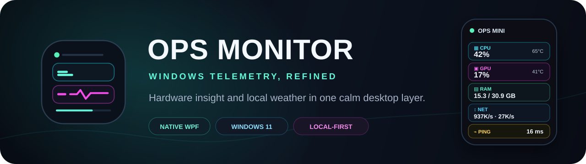
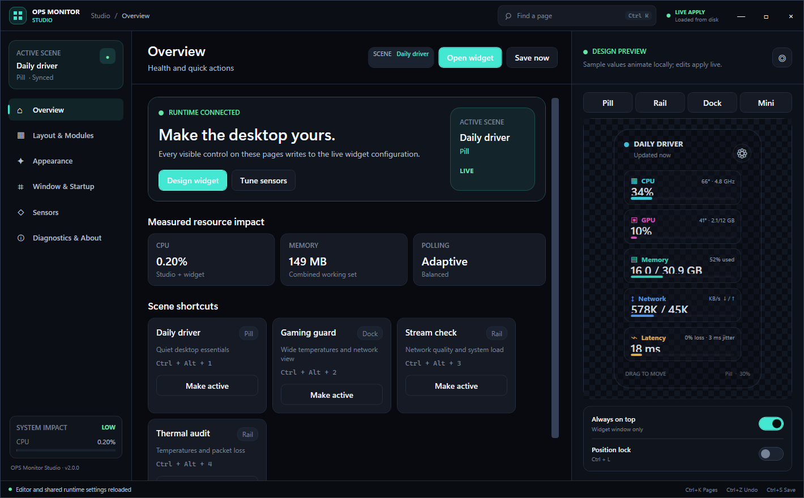
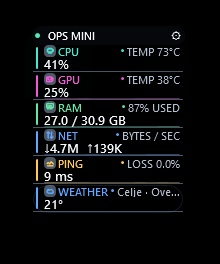
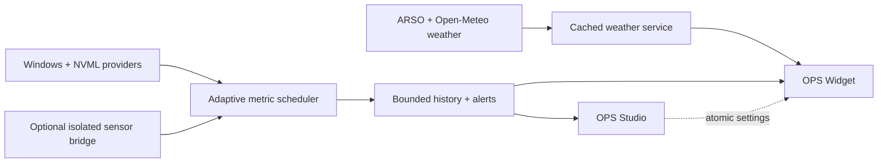

<p align="center">
  
</p>

<p align="center">
  
  
  
  
</p>

<p align="center">
  A slim, local-first Windows 11 performance widget with serious telemetry,<br>
  a full visual Studio, and a weather suite built for Slovenia.
</p>

## The desktop, without the dashboard clutter

OPS Monitor keeps the numbers that matter within reach while staying visually
quiet. Its native always-on-top Widget tracks hardware, connectivity, storage,
battery, and local weather. The separate Studio handles deep customization so
the desktop overlay remains clean.

<p align="center">
  
</p>

### Built to disappear until you need it

- **Four responsive layouts** — Pill, Rail, Dock, and an ultra-small Mini.
- **Real hardware telemetry** — CPU, GPU, RAM, VRAM, disks, fans, clocks,
  power, temperatures, battery, uptime, ping, jitter, and packet loss.
- **Local weather intelligence** — current conditions, hourly and eight-day
  forecasts, official ARSO alerts, air quality, UV, pollen, and animated radar.
- **A real customization surface** — themes, opacity, scale, density, modules,
  sensor pinning, refresh rate, startup, lock, click-through, and window rules.
- **Desktop-native behavior** — draggable, resizable, per-monitor DPI aware,
  always-on-top, sign-in startup, and keyboard recovery for locked overlays.
- **Honest sensor states** — unavailable or stale readings show as unavailable;
  OPS Monitor never invents a temperature.

## One widget, multiple moods

The Widget can be a narrow ambient rail, the original glass Pill, a single-row
Dock, or a compact Mini. Every layout is clamped to readable dimensions and
persists its position and scale.

<table>
  <tr>
    <td width="34%" align="center">
      
    </td>
    <td>
      <h3>Mini, but still useful</h3>
      <p>CPU and GPU temperatures, memory, live throughput, ping, packet loss,
      and weather fit into a tiny dark glass surface. The green status dot
      pulses when fresh data arrives.</p>
      <p>Open Studio when you want control; close it when you want calm.</p>
    </td>
  </tr>
</table>

## Weather that understands place

The default location is Celje, Slovenia, and any location can be searched and
saved. OPS Monitor blends forecast and air-quality data from Open-Meteo with
official Slovenian observations, warnings, and radar from ARSO. Results are
cached, refresh work never overlaps, and the radar only downloads when opened.

<p align="center">
  
</p>

<table>
  <tr>
    <td width="50%"></td>
    <td width="50%"></td>
  </tr>
  <tr>
    <td align="center"><sub><strong>Official ARSO radar</strong> with playback, timeline, and zoom</sub></td>
    <td align="center"><sub><strong>Atmosphere view</strong> with AQI, pollutants, pollen, UV, and daylight</sub></td>
  </tr>
</table>

## Telemetry architecture



Polling is adaptive and non-overlapping. History is bounded and downsampled,
UI updates are coalesced to the chosen cadence, and dragging or resizing never
restarts telemetry providers. Widget and Studio have no third-party runtime
packages; the optional low-level sensor bridge is isolated from both apps.

## Quick start

### Requirements

- Windows 11 x64
- .NET 10 Desktop Runtime for a framework-dependent build
- .NET SDK 10.0.302 or a compatible 10.0 patch to build from source

### Build, test, and run

```powershell
git clone https://github.com/seNkoKG/ops-monitor.git
cd .\ops-monitor\native
.\Build.ps1
.\Run.ps1 -Application Widget -Configuration Release
.\Run.ps1 -Application Studio -Configuration Release
```

`Build.ps1` restores the solution, builds Release, and runs the deterministic
behavioral test suites.

### Install for the current user

```powershell
cd .\native
.\Build.ps1 -Configuration Release -Publish -SelfContained
.\Install.ps1 -SelfContained -EnableStartup -DesktopShortcut -Launch
```

The installer uses `%LOCALAPPDATA%\Programs\OPS Monitor`, creates verified
shortcuts, preserves settings during upgrades, and can install without admin
rights. See the [native build and operations guide](native/README.md) for
package variants, visual-QA flags, CPU temperature setup, and clean uninstall.

## CPU temperature and advanced sensors

Windows does not expose reliable package temperature data on every system.
OPS Monitor therefore keeps privileged hardware access out of the desktop apps:
an optional broker reads supported sensors, validates the values, writes a
versioned snapshot, and exits when the Widget closes.

On supported Ryzen systems this path requires the signed official PawnIO driver.
OPS Monitor never disables Memory Integrity and never falls back to WinRing0.
If a fresh plausible reading is unavailable, the UI correctly shows `TEMP N/A`.
Full setup and recovery steps are in [native/README.md](native/README.md#cpu-temperature-troubleshooting).

## Privacy and data sources

- Hardware metrics, history, alerts, and settings remain on the PC under
  `%LOCALAPPDATA%\OPS Monitor`.
- There is no account, advertising SDK, analytics SDK, or telemetry upload.
- Enabling Weather sends the selected coordinates to the weather providers.
- Weather data: [ARSO](https://meteo.arso.gov.si/),
  [Open-Meteo](https://open-meteo.com/), and the
  [CAMS European atmospheric model](https://atmosphere.copernicus.eu/).
- Third-party notices are documented in
  [native/THIRD-PARTY-NOTICES.md](native/THIRD-PARTY-NOTICES.md).

## Repository map

```text
native/
├─ src/OpsMonitor.Core/          telemetry, settings, alerts, history
├─ src/OpsMonitor.Widget/        always-on desktop overlay + weather suite
├─ src/OpsMonitor.Studio/        visual configuration and diagnostics
├─ src/OpsMonitor.SensorBridge/  optional isolated hardware sensor broker
├─ tests/                        deterministic behavioral test executables
└─ tools/                        screenshot and resource-impact utilities
```

The root-level PowerShell implementation is the original prototype and remains
for reference. Active production development lives in `native/`.

## Project status

OPS Monitor v2 is actively developed and currently passes **41 Core behavior
checks** plus **11 Sensor Bridge checks** in Release. The native applications
build with warnings treated as errors.

No open-source license has been selected yet. Until one is added, the source is
available for viewing but no reuse rights are granted by default.

---

<p align="center">
  <br>
  <sub>Designed for information density without visual noise.</sub>
</p>
